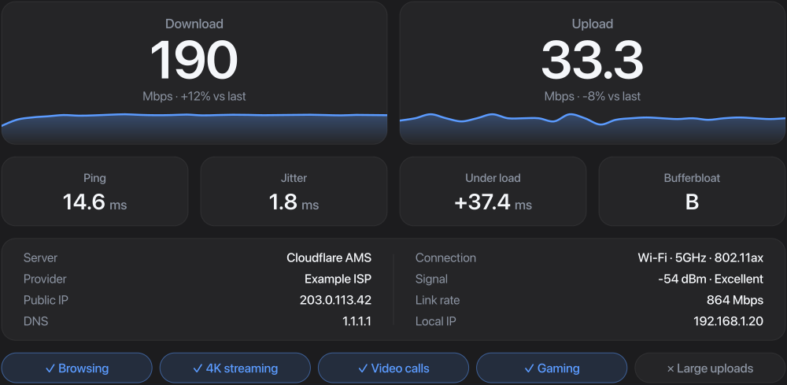
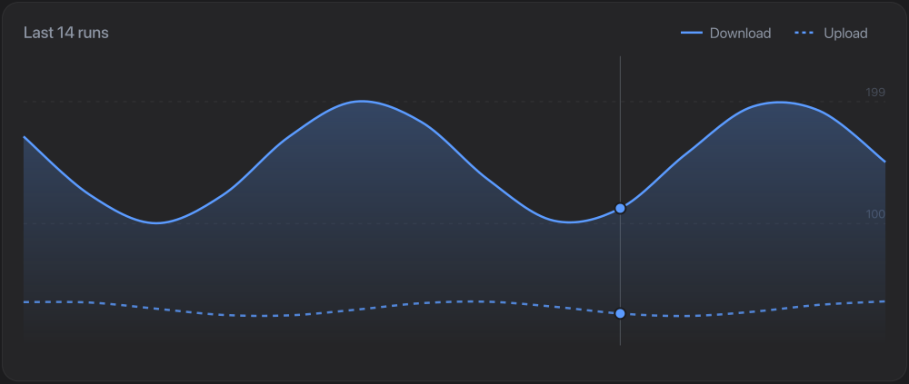

# Speed Test for Raycast

A clean internet speed test for Raycast. Live charts, latency under load, Wi-Fi details, history and a menu bar monitor.



## What it measures

- Download and upload (6 parallel streams, 8 s each, 1.5 s warmup excluded)
- Ping and jitter (TCP handshake time, so no server processing noise)
- Latency under load, with a bufferbloat grade (A+ to F)
- Connection details: server, provider, public and local IP, DNS, Wi-Fi band, signal and link rate
- What the connection is good for: browsing, 4K, video calls, gaming, large uploads

## Commands

- **Test Internet Speed**: the main test view
- **Speed Test History**: trend chart and details for every past run
- **Speed Test Menu Bar**: last result in the menu bar, quick test every hour

Set the test length (Quick about 12 s, Full about 20 s) in the extension preferences.



It uses Cloudflare's speed endpoints (`speed.cloudflare.com`). No binary download, no account.

## Shortcuts

| Action | Shortcut |
| --- | --- |
| Run again | `⌘R` |
| Copy results | `⌘⇧C` |
| Show history | `⌘⇧H` |
| Toggle quick / full test | `⌘⇧R` |

## Install

```sh
git clone https://github.com/laurenschristian/raycast-speed-test
cd raycast-speed-test
npm install
npm run dev   # installs into Raycast; stop it with Ctrl+C, the command stays
```
